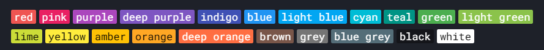
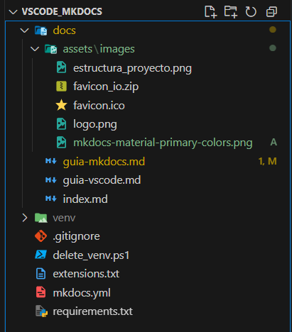
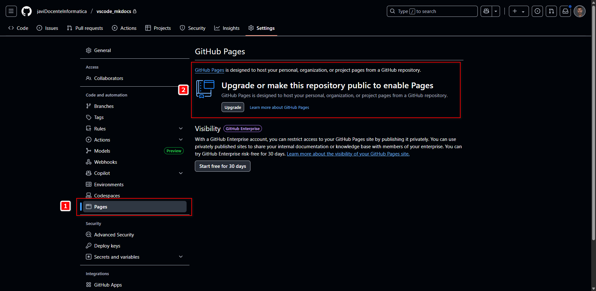
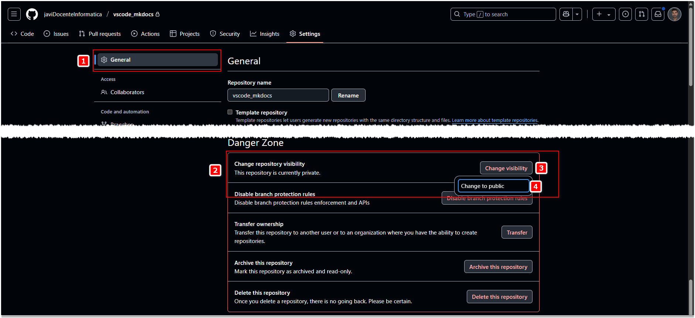
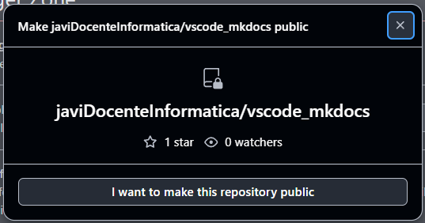
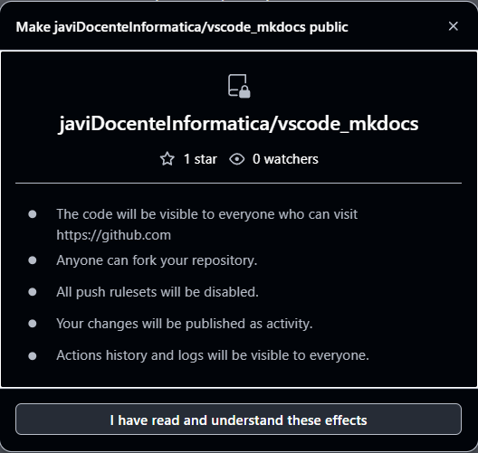
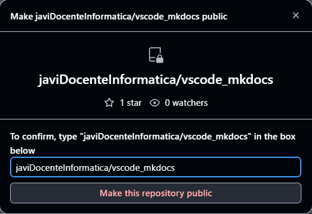
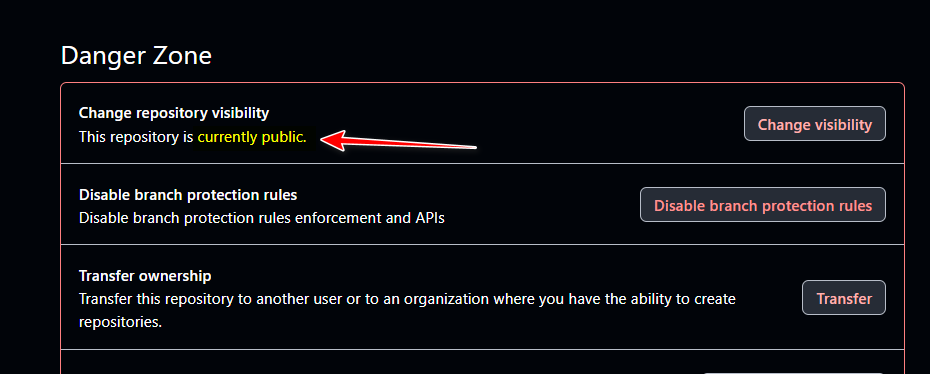

# MkDocs (Python Package)

---

MkDocs es una herramienta que nos permite generar sitios web estáticos a partir de archivos Markdown.  
Es muy útil para crear documentación técnica y publicarla fácilmente, por ejemplo, en **GitHub Pages**.

---

## 🧩 1. Requisitos previos

---

Antes de comenzar, debemos asegurarnos de tener **Python 3** instalado en nuestro sistema.

Podemos comprobarlo desde una terminal ejecutando:

```powershell
python --version
```

o

```powershell
python3 --version
```

Si no lo tenemos, podemos descargarlo desde la página oficial:  
🧷 <a href="https://www.python.org/downloads" target="_blank" rel="noopener">https://www.python.org/downloads</a>

> Durante la instalación, es importante **activar la opción**:  
> ✅ "Add Python to PATH"

También necesitamos tener disponible `pip`, que normalmente se instala junto a Python:

```python
pip --version
```

---

## 🧩 2. Crear un entorno virtual (opcional, pero recomendado)

---

Para evitar conflictos con otras herramientas y mantener las dependencias organizadas, podemos crear un entorno virtual en el directorio donde vayamos a trabajar:

```python
python -m venv .venv
```

Luego lo activamos según el sistema operativo:

- En **Windows (CMD)**:

```cmd
.venv\Scripts\activate
```

- En **PowerShell**:

```powershell
.venv\Scripts\Activate.ps1
```

- En **Linux/macOS**:

```bash
source .venv/bin/activate
```

---

## 🧩 3. Instalar MkDocs

---

Con el entorno activado, instalamos MkDocs con:

```python
pip install mkdocs
```

También podemos instalar el tema **Material for MkDocs**, que nos permitirá generar documentación más visual y moderna:

```python
pip install mkdocs-material
```

---

## 🧩 4. Crear un nuevo proyecto con MkDocs

---

Creamos un nuevo proyecto ejecutando:

```python
mkdocs new mi-documentacion
```

Esto generará una estructura como esta:

```pgsql
mi-documentacion/
├── docs/
│   └── index.md
└── mkdocs.yml
```

- La carpeta `docs/` contendrá nuestros archivos `.md`.

- El archivo `mkdocs.yml` nos servirá para configurar el sitio web.

---

## 🧩 5. Ejecutar el servidor local

---

Accedemos a la carpeta del proyecto:

```powershell
cd mi-documentacion
```

Y arrancamos el servidor de desarrollo con:

```powershell
mkdocs serve
```

Esto abrirá un sitio web local en:  
👉 <a href="http://127.0.0.1:8000" target="_blank" rel="noopener">http://127.0.0.1:8000</a>

A medida que editemos los archivos Markdown, los cambios se reflejarán automáticamente en el navegador.

## 🧩 6. Exportar los módulos del entorno virtual

---

Si hemos utilizado un **entorno virtual** para instalar MkDocs y sus extensiones, es importante generar un archivo con la lista de dependencias.  
De esta forma, otras personas podrán instalar exactamente los mismos paquetes y versiones.

### Paso 1. Asegurarnos de que el entorno virtual está activado

Antes de exportar, activamos el entorno si no lo estaba ya:

- En **CMD**:

```cmd
.venv\Scripts\activate
```

- En **PowerShell**:

```powershell
.venv\Scripts\Activate.ps1
```

- En **Linux/macOS**:

```bash
source .venv/bin/activate
```

### Paso 2. Generar el archivo `requirements.txt`

Ejecutamos:

```bash
pip freeze > requirements.txt
```

Esto generará un archivo llamado `requirements.txt` en el directorio actual, con todas las dependencias instaladas en el entorno.

Ejemplo de contenido:

```makefile
click==8.1.7
Jinja2==3.1.2
Markdown==3.5.2
mkdocs==1.5.3
mkdocs-material==9.5.13
...
```

### Paso 3. Incluirlo en el proyecto

Este archivo debe añadirse al repositorio (por ejemplo, junto al archivo `mkdocs.yml`) para que otros desarrolladores puedan instalar las mismas dependencias con:

```bash
pip install -r requirements.txt`
```

---

## 🧩 7. Configurar el archivo `mkdocs.yml`

---

El archivo `mkdocs.yml` es el archivo de configuración principal del proyecto.  
Desde aquí podemos definir:

- El **nombre del sitio web**.

- El **tema visual** (como `material`).

- El **menú de navegación**.

- Otros ajustes como el idioma, favicon, estilos personalizados, etc.

---

### 📌 Título del sitio y tema

Abrimos el archivo `mkdocs.yml` y configuramos al menos estas dos líneas básicas:

```yaml
site_name: Mi Documentación
theme:
  name: material
```

Esto define el nombre del sitio y activa el tema `material` (si lo hemos instalado previamente con `pip install mkdocs-material`).

---

### 📌 Navegación

Podemos personalizar el orden y los títulos del menú con la clave `nav`.  
Por ejemplo, si hemos creado varios archivos `.md` dentro de `docs/`, como:

```pgsql
docs/
├── index.md
├── guia-vscode.md
├── guia-mkdocs.md
```

Entonces configuramos la navegación así:

```yaml
nav:
  - 0. Inicio: index.md
  - 1. Visual Studio Code: guia-vscode.md
  - 2. MkDocs: guia-mkdocs.md
```

Esto genera un menú superior con los nombres que hayamos indicado, enlazando a las páginas correspondientes.

---

### 🛠️ Resultado completo de ejemplo

Este sería un archivo `mkdocs.yml` básico:

```yaml
#mkdocs.yml
site_name: Documentación VsCode + MkDocs
theme:
  name: material

nav:
  - 0. Inicio: index.md
  - 1. Visual Studio Code: guia-vscode.md
  - 2. MkDocs: guia-mkdocs.md
```

---

### ✅ Probar los cambios

Una vez guardado el archivo `mkdocs.yml`, volvemos a ejecutar:

```powershell
mkdocs serve
```

Y actualizamos el navegador en <a href="http://127.0.0.1:8000/" target="_blank" rel="noopener">http://127.0.0.1:8000</a> para ver el nuevo menú y título aplicados.

---

## 🧩 8. Personalización visual del sitio

---

MkDocs permite personalizar el diseño de nuestro sitio si estamos utilizando el tema `material`.  
Podemos modificar los **colores**, el **favicon**, el **logo**, el **idioma** y más elementos visuales para adaptarlo a nuestras necesidades.

> 📚 Documentación oficial del tema Material:  
> 🧷 <a href="https://squidfunk.github.io/mkdocs-material/setup/changing-the-colors/" target="_blank" rel="noopener">https://squidfunk.github.io/mkdocs-material/setup/changing-the-colors/</a>

---

### 🎨 Colores primario y de acento

Podemos elegir un color principal (barra superior) y un color de acento (enlaces, botones, resaltados, etc.).

Ejemplo en `mkdocs.yml`:

```yaml
theme:
  name: material
  palette:
    primary: indigo
    accent: blue
```

Colores disponibles: `red`, `pink`, `purple`, `deep purple`, `indigo`, `blue`, `light blue`, `cyan`, `teal`, `green`, `light green`, `lime`, `yellow`, `amber`, `orange`, `deep orange`, `brown`, `grey`, `blue grey`.

{ loading=lazy }
///caption
📷 mkdocs-material-primary-colors
///

> 📝 Referencia de colores disponibles:  
> 🧷 <a href="https://squidfunk.github.io/mkdocs-material/setup/changing-the-colors/#primary-and-accent-colors" target="_blank" rel="noopener">https://squidfunk.github.io/mkdocs-material/setup/changing-the-colors/#primary-and-accent-colors</a>

---

### 🌐 Idioma del sitio

Podemos indicar el idioma para que los elementos de la interfaz (como "Search" o "Table of contents") aparezcan traducidos:

```yaml
theme:
  name: material
  language: es
```

> 🌍 Lista de idiomas disponibles:  
> 🧷 <a href="https://squidfunk.github.io/mkdocs-material/setup/changing-the-language/" target="_blank" rel="noopener">https://squidfunk.github.io/mkdocs-material/setup/changing-the-language/</a>

---

### 🖼️ Logo y favicon: ¿en qué se diferencian?

Antes de configurarlos, conviene saber qué función tiene cada uno:

- **Favicon**: es el pequeño icono que aparece en la pestaña del navegador, en los marcadores o cuando se guarda el sitio como acceso directo.

- **Logo**: es la imagen que aparece en la barra de navegación del sitio, junto al título. Suele ser más grande y representativo.

Ambos elementos se configuran dentro del bloque `theme:` en el archivo `mkdocs.yml`, y deben estar ubicados **dentro de la carpeta `docs/`**, preferiblemente organizados en una subcarpeta `assets/images/`.

---

### 📁 Estructura recomendada del proyecto

```pgsql
docs/
├── index.md
├── guia-vscode.md
├── guia-mkdocs.md
├── assets/
│   └── images/
│       ├── logo.svg         ✅ Logo (preferentemente en formato SVG)
│       └── favicon.png      ✅ Favicon (formato PNG de 32x32 o similar)
```

---

### ⚙️ Configuración correcta en `mkdocs.yml`

```yaml
theme:
  name: material
  language: es
  palette:
    primary: indigo
    accent: blue
  logo: assets/images/logo.svg
  favicon: assets/images/favicon.png
```

> ✅ Ambos deben definirse dentro de la sección `theme:`.  
> ⚠️ Ya no se debe utilizar `extra.favicon`, ya que es una práctica obsoleta y no compatible con las últimas versiones del tema Material.

---

### 📝 Recomendaciones importantes

- El **logo** puede estar en formato `.svg` o `.png`. Se recomienda **`.svg`** por su nitidez y escalabilidad.

- El **favicon** debe estar en formato `.png` o `.ico`, preferentemente en resolución **32x32 px**.

- Asegurarse de que los archivos existen y están correctamente nombrados (sin espacios ni mayúsculas).

- Después de cualquier cambio, **reiniciamos el servidor** con `Ctrl + C` y luego `mkdocs serve`.

- Si el favicon no se actualiza, **forzamos la recarga en el navegador** con `Ctrl + Shift + R` o abrimos en modo incógnito.

---

### 📚 Enlace a la documentación oficial

🧷 <a href="https://squidfunk.github.io/mkdocs-material/setup/changing-the-logo-and-icons/" target="_blank" rel="noopener">https://squidfunk.github.io/mkdocs-material/setup/changing-the-logo-and-icons/</a>

---

## 🖼️ 9. Imágenes

🧷 <a href="https://squidfunk.github.io/mkdocs-material/reference/images/?h=images" target="_blank" rel="noopener">
Donath, M. (s. f.). Images - Material for MkDocs. Github.io. Recuperado 22 de junio de 2025, de https://squidfunk.github.io/mkdocs-material/reference/images/
</a>

🧷 <a href="https://github.com/blueswen/mkdocs-glightbox#usage" target="_blank" rel="noopener">
Blueswen. (s. f.). mkdocs-glightbox: A MkDocs plugin supports image lightbox (zoom effect) with GLightbox. Recuperado 22 de junio de 2025, de https://github.com/blueswen/mkdocs-glightbox#usage
</a>

🧷 <a href="https://squidfunk.github.io/mkdocs-material/setup/extensions/python-markdown-extensions/#caption" target="_blank" rel="noopener">
Donath, M. (s. f.). Python Markdown Extensions - Material for MkDocs. Github.io. Recuperado 22 de junio de 2025, de https://squidfunk.github.io/mkdocs-material/setup/extensions/python-markdown-extensions/#caption
</a>

🧷 <a href="https://squidfunk.github.io/mkdocs-material/reference/images/#image-captions" target="_blank" rel="noopener">
Donath, M. (s. f.). Images - Material for MkDocs. Github.io. Recuperado 22 de junio de 2025, de https://squidfunk.github.io/mkdocs-material/reference/images/#image-captions
</a>

🧷 <a href="https://facelessuser.github.io/pymdown-extensions/extensions/blocks/plugins/caption/" target="_blank" rel="noopener">
Caption. (s. f.). Github.io. Recuperado 22 de junio de 2025, de https://facelessuser.github.io/pymdown-extensions/extensions/blocks/plugins/caption/
</a>

---

## 📙 10. Contenido de `mkdocs.yml` y Estructura del Proyecto

El **contenido** final que tenemos actualmente en nuestro documento **de configuración `mkdocs.yml`**:  

```yaml
#mkdocs.yml
site_name: Documentación VsCode + MkDocs
repo_url: https://github.com/javiDocenteInformatica/vscode_mkdocs
theme:
  name: material
  language: es
  palette:
    primary: indigo
    accent: blue
  logo: assets/images/logo.png
  favicon: assets/images/favicon.ico

nav:
  - 0. Inicio: index.md
  - 1. Visual Studio Code: guia-vscode.md
  - 2. MkDocs: guia-mkdocs.md
```

La **estructura completa del proyecto** actualmente se verá como sigue:

{ loading=lazy }
///caption
📷 Estructura del proyecto
///

## 🐱📃 11. subir el proyecto a GitHub Pages para hacerlo público

🧷 *Repositorio publicado:*  
<a href="https://javidocenteinformatica.github.io/vscode_mkdocs/" target="_blank" rel="noopener">
https://javidocenteinformatica.github.io/vscode_mkdocs/
</a>

🧷 *Enlace CLI oficial de MkDocs:*  
<a href="https://www.mkdocs.org/user-guide/cli/#mkdocs" target="_blank" rel="noopener">
https://www.mkdocs.org/user-guide/cli/#mkdocs
</a>

### Introducción

Una vez tenemos nuestra documentación local generada con MkDocs y funcionando correctamente, el siguiente paso natural es hacerla pública para que cualquiera pueda consultarla desde cualquier navegador.  
Para ello, utilizaremos **GitHub Pages**, un servicio gratuito que nos permite servir contenido estático directamente desde un repositorio de GitHub.

---

### 11.1 Requisitos previos

Antes de continuar, asegúrate de haber cumplido los siguientes puntos:

- Tienes una cuenta en GitHub y un repositorio creado con el código fuente de tu proyecto MkDocs.

- Has configurado correctamente tu fichero `mkdocs.yml`.

- Has instalado y activado un entorno virtual con MkDocs y ejecutado con éxito `mkdocs build`.

También se recomienda añadir al final del fichero `mkdocs.yml` el campo `site_url` con la URL pública de la documentación:

```yaml
site_url: https://javidocenteinformatica.github.io/vscode_mkdocs/
```

Esto ayuda a MkDocs a generar correctamente los enlaces internos (por ejemplo, en el índice o los breadcrumbs), especialmente si usamos plugins o generamos sitemaps.

---

### 11.2 Publicar la documentación en GitHub Pages

Para publicar la documentación, simplemente debemos ejecutar el siguiente comando:

```bash
mkdocs gh-deploy
```

Este comando realiza automáticamente las siguientes acciones:  

1. Limpia la carpeta `site/`.

2. Genera el contenido actualizado de la documentación.

3. Crea (o actualiza) la rama `gh-pages` en tu repositorio.

4. Sube el contenido a esa rama y configura GitHub Pages para servirlo desde ahí.

Si todo va bien, verás un mensaje como este:

```bash
INFO    -  Your documentation should shortly be available at: https://<usuario>.github.io/<repositorio>/
```

---

### 11.3 Activar GitHub Pages desde la configuración del repositorio

Aun después de hacer el `gh-deploy`, es necesario activar GitHub Pages desde la interfaz web de GitHub. Vamos a ver cómo se hace paso a paso.

#### Paso 1: Accedemos a la pestaña **Settings** del repositorio

{ loading=lazy }
///caption
📷 Paso 1: Settings > Pages
///

---

#### Paso 2: En el menú lateral, entramos en la opción **Pages**

{ loading=lazy }
///caption
📷 Paso 2: Menú lateral Pages
///

---

#### Paso 3: Elegimos la rama `gh-pages` y la carpeta `/ (root)` como fuente

{ loading=lazy }
///caption
📷 Paso 3: Selección de rama y carpeta
///

---

#### Paso 4: Hacemos clic en **Save** para aplicar los cambios  

{ loading=lazy }
///caption
📷 Paso 4: Guardar configuración
///

---

### 11.4 Hacer el repositorio público

GitHub Pages **no funciona en repositorios privados** a menos que tengamos una cuenta GitHub Pro. Por tanto, si tu repositorio es privado, deberás cambiar su visibilidad a público.

#### Paso 5: Entra en la sección **General** > baja hasta la **Danger Zone**

{ loading=lazy }
///caption
📷 Paso 5: Danger Zone
///

---

#### Paso 6: Haz clic en **Change visibility** y selecciona **Change to public**

{ loading=lazy }
///caption
📷 Paso 6: Confirmar cambio de visibilidad
///

---

#### Paso 7: Confirma los efectos y escribe el nombre del repositorio para validar

{ loading=lazy }
///caption
📷 Paso 7: Confirmación final
///

<!-- <a href="assets/github_pages/activando_github_pages_7.png" target="_blank">
  
</a> -->
<!-- [](/assets/github_pages/activando_github_pages_7.png){ target="_blank" rel="noopener"} -->

---

### 11.5 Acceder a la página pública

Después de guardar todos los cambios y esperar unos segundos, podrás acceder a tu documentación en la siguiente URL:

```bash
https://<usuario>.github.io/<repositorio>/
```

En nuestro caso:

🧷 <a href="https://javidocenteinformatica.github.io/vscode_mkdocs/" target="_blank" rel="noopener">
https://javidocenteinformatica.github.io/vscode_mkdocs/
</a>

---
